# PyCurl


PyCurl is a lightweight, modern CLI tool written in Python that brings the power of `curl` with the ergonomics of Python's `requests` library. It provides a user-friendly command-line interface for making HTTP requests, managing authentication, and handling configurations.

## How It Works

PyCurl mimics the simplicity of `curl` but adds structured output and state management.

```mermaid
flowchart LR
    User([👤 User])
    CLI[("💻 PyCurl CLI")]
    Config["⚙️ Config/Auth"]
    Network("🌐 Internet")
    
    subgraph Core ["🔄 Core Logic"]
        direction TB
        Parser["📝 Typer Parser"]
        Requester["🚀 Requests Engine"]
        Formatter["✨ Rich Formatter"]
    end

    User ==>|Command| CLI
    CLI --> Parser
    Parser <--> Config
    Parser --> Requester
    Requester <==>|HTTP/HTTPS| Network
    Requester --> Formatter
    Formatter -->|Pretty Output| User

    classDef plain fill:#1a1a1a,stroke:#fff,color:#fff;
    classDef highlight fill:#22226e,stroke:#f2f0f0,stroke-width:2px,color:#fff;
    class User plain;
    class CLI,Config highlight;
```



## Features

- **Intuitive HTTP Methods**: robust support for `GET`, `POST`, `PUT`, `PATCH`, `DELETE`.
- **Rich Output**: Beautifully formatted JSON responses and error messages using `rich`.
- **Token Management**:
  - Securely save and manage authentication tokens.
  - Support for custom aliases for tokens.
  - Insert tokens automatically into headers or cookies.
- **In-built Documentation**: Interactive documentation viewer directly in the CLI.
- **Configuration System**:
  - Persist settings across sessions.
  - Interactive configuration generation with `pycurl config generate`.
- **Cross-Platform**: Works seamlessly on Windows, macOS, and Linux.
## 🚀 DevOps & Deployment

We use **GitHub Actions** for our CI/CD pipeline to ensure code quality and automated testing.

### 🔄 CI/CD Pipeline

Our pipeline validates every commit:
1.  **Testing**: Runs unit and integration tests. (will be comming soon)
2.  **Build**: Verifies that the package builds correctly.


## 📥 Download & Installation

### Option 1: Download Pre-built Binary (Recommended)
You can download the latest standalone executable for your platform from the [Releases](https://github.com/YashashavGoyal/pycurl/releases) page.
1. Go to the [Releases](https://github.com/YashashavGoyal/pycurl/releases) section.
2. Download the version for your OS (Windows, Linux, or macOS).
3. (Optional) Add the executable to your system PATH to run it from anywhere.

### Option 2: Install via pip (Development)
**Prerequisites**: Python 3.10+
```bash
git clone https://github.com/YashashavGoyal/pycurl.git
cd pycurl
pip install .
```

## 🛠️ Usage

### Initialization
Initialize your environment:
```bash
pycurl init
```

### Making Requests

**Simple GET Request**
```bash
pycurl get https://jsonplaceholder.typicode.com/posts/1 --show-content
```

**POST Request with JSON Data**
```bash
pycurl post https://api.example.com/users --json '{"name": "Alice"}'
```

**POST Request from File**
```bash
pycurl post https://api.example.com/users --json @data.json
```

### Authentication & Tokens
Save a token with an alias:
```bash
pycurl token set --alias myapi --token "your-token-here"
```

Use the saved token in a request:
```bash
pycurl get https://api.example.com/protected -U myapi
```

### In-built Docs
View detailed documentation for any command:
```bash
pycurl docs get
pycurl docs post
```

## 📂 Modular Code Structure

```bash
├── app/
│   ├── commands/            # CLI Command Implementations
│   │   ├── docs/            # In-built Markdown Docs
│   │   ├── auth/            # Auth Management Logic
│   │   ├── config/          # Configuration Logic
│   │   ├── token/           # Token Management Logic
│   │   ├── get.py           # GET Command
│   │   ├── post.py          # POST Command
│   │   └── ...
│   ├── utils/               # Helpers (UI, Parsers, Auth Utils)
│   └── main.py              # Application Entry Point
├── .github/                 # CI/CD Workflows (Releases)
├── pyproject.toml           # Metadata & Dependencies
└── README.md
```

---

**Author**: Yashashav Goyal

<a href="https://github.com/YashashavGoyal">
  
</a>
<a href="https://linkedin.com/in/yashashavgoyal">
  
</a>
<a href="https://twitter.com/YashashavGoyal">
  
</a>

**License**: MIT
